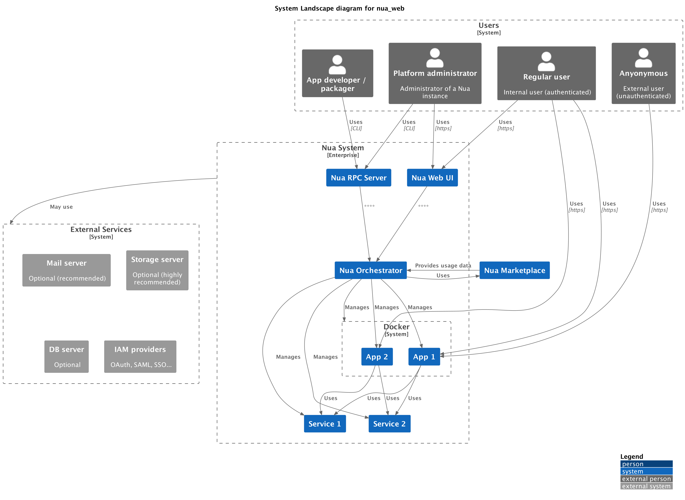

# Nua


[](https://codecov.io/github/abilian/nua)

> **Warning**
> This code is currently highly experimental, and not meant for public consumption.
> We hope to have a usable, alpha or beta quality, release, by the end of Q1 2023.

## What is Nua?

### Vision

Nua streamlines the development, selection, installation and resilient operation of web applications in a self-hosted cloud environment.

It is primarily aimed at users (SMEs, associations, public services, etc.) who wish to benefit from the simplicity of the cloud at the lowest cost without compromising the principles of digital sovereignty.

Its watchwords are: simplicity, resilience and equity.

### Concept Map


### Use cases


### Presentation

See: <https://speakerdeck.com/sfermigier/nua-a-self-hosted-resilient-paas>

----

## Hacking on Nua

### Technical Architecture



### Subpackages

The Nua project is a monorepo, split into several subpackages:

- `nua-lib`: common code for all Nua packages ([details](./nua-lib/README.md)).
- `nua-cli`: command-line interface for Nua  ([details](./nua-cli/README.md)).
- `nua-runtime`: runtime for Nua apps  ([details](./nua-runtime/README.md)).
- `nua-autobuild`: build Docker images used by Nua  ([details](./nua-autobuild/README.md)).
- `nua-build`: build system for Nua packages  ([details](./nua-build/README.md)).
- `nua-orchestrator`: orchestrator for Nua applications  ([details](./nua-orchestrator/README.md)).

It also comprises several example applications, as well as a few real-world applications: [`apps`](./apps).

### Roadmap and current status

The roadmap for the projet is kept up to date on [this kanban board](https://github.com/abilian/nua/projects/1).

As of 2023/01/05, we have a:

- The "builder" CLI that can build container images.
- The "orchestrator" CLI that can deploy and manage container images.
- We have started packaging some applications.
- Work has started on a common `nua` CLI:

```
$ nua --help

 Usage: nua [OPTIONS] COMMAND [ARGS]...

 Nua local CLI.

╭─ Options ────────────────────────────────────────────────────────────────────╮
│ --version             -V        Show Nua version and exit.                   │
│ --install-completion            Install completion for the current shell.    │
│ --show-completion               Show completion for the current shell, to    │
│                                 copy it or customize the installation.       │
│ --help                          Show this message and exit.                  │
╰──────────────────────────────────────────────────────────────────────────────╯
╭─ Commands ───────────────────────────────────────────────────────────────────╮
│ config           Show application config.                                    │
│ deploy           Deploy an application.                                      │
│ destroy          Destroy an application.                                     │
│ help             Show help.                                                  │
│ init             Initialize a new application.                               │
│ list             List applications.                                          │
│ logs             Show application logs.                                      │
│ status           Show Nua status.                                            │
│ version          Show Nua version and exit.                                  │
╰──────────────────────────────────────────────────────────────────────────────╯
```

### REUSE (licensing compliance)

Result of the `reuse lint` command invocation:

```
$ reuse lint
> * Bad licenses:
> * Deprecated licenses:
> * Licenses without file extension:
> * Missing licenses:
> * Unused licenses:
> * Used licenses: AGPL-3.0-only, CC-BY-4.0, MIT
> * Read errors: 0
> * Files with copyright information: 284 / 284
> * Files with license information: 284 / 284

> Congratulations! Your project is compliant with version 3.0 of the REUSE Specification :-)
```
