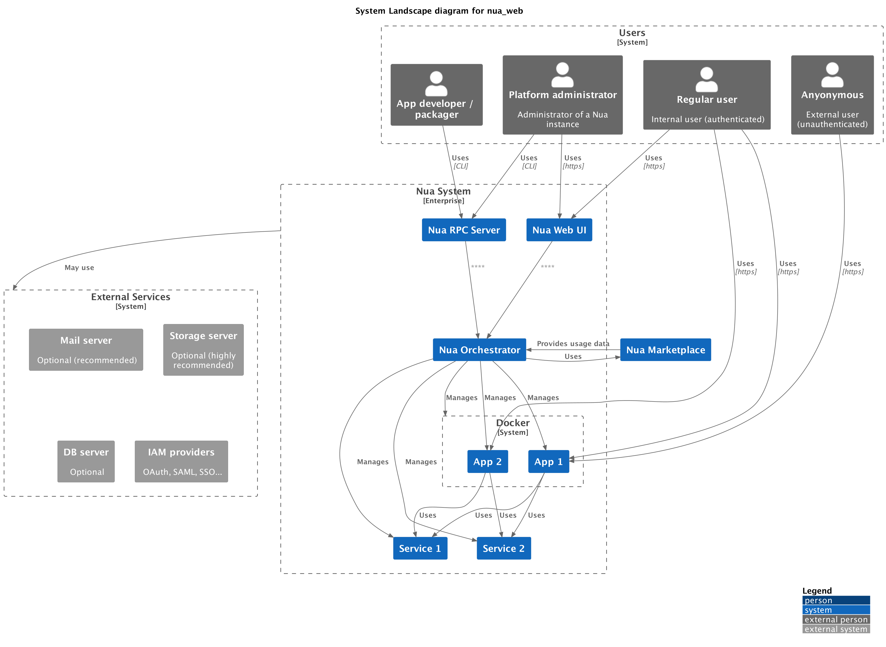

# Nua

## Vision

Nua streamlines the development, selection, installation and resilient operation of web applications in a self-hosted cloud environment.

It is primarily aimed at users (SMEs, associations, public services, etc.) who wish to benefit from the simplicity of the cloud at the lowest cost without compromising the principles of digital sovereignty.

Its watchwords are: simplicity, resilience and equity.

## Concept Map

## Use cases

## Technical Architecture

