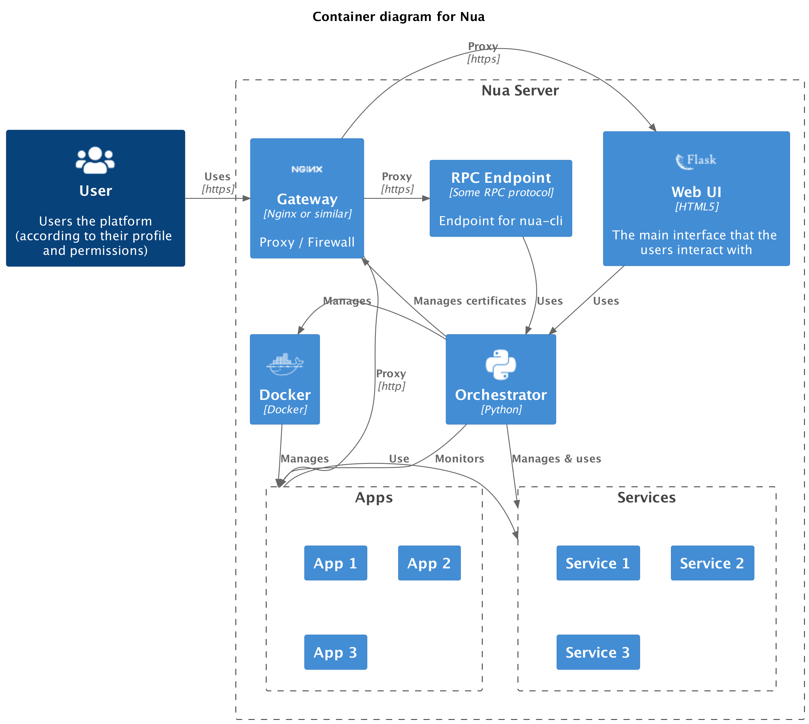

# Nua Architecture

## C4 Diagrams

### Context diagram (level 1)

### Container diagrams (level 2)

## Components

The main components are:

- The [orchestrator](../orchestrator/)
- The builder [todo]
