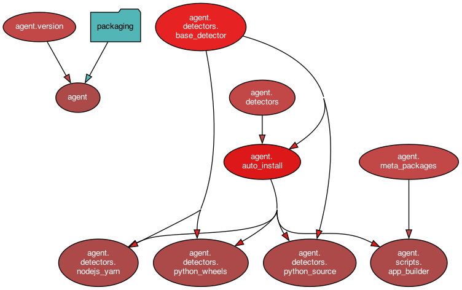

# Nua Agent

[Nua](https://nua.rocks/) is an open source, self-hosted cloud platform project (a PaaS - platform as a service).

This packaged is used internally. The main entry point is the `nua` command line tool (see: [Nua on PyPI](https://pypi.org/project/nua/) or [nua-cli on GitHub](https://github.com/abilian/nua/tree/main/nua-cli)).

The `nua-agent` package provides the agent that runs inside the Docker image *during the build of the application*.

Note: don't depend on `nua-agent` being installed in the Docker image. It is not a runtime dependency.

## Content

`nua-agent` provides:

- The `app-builder` script: actual builder of the application inside the Docker image.

## Dependency graph

