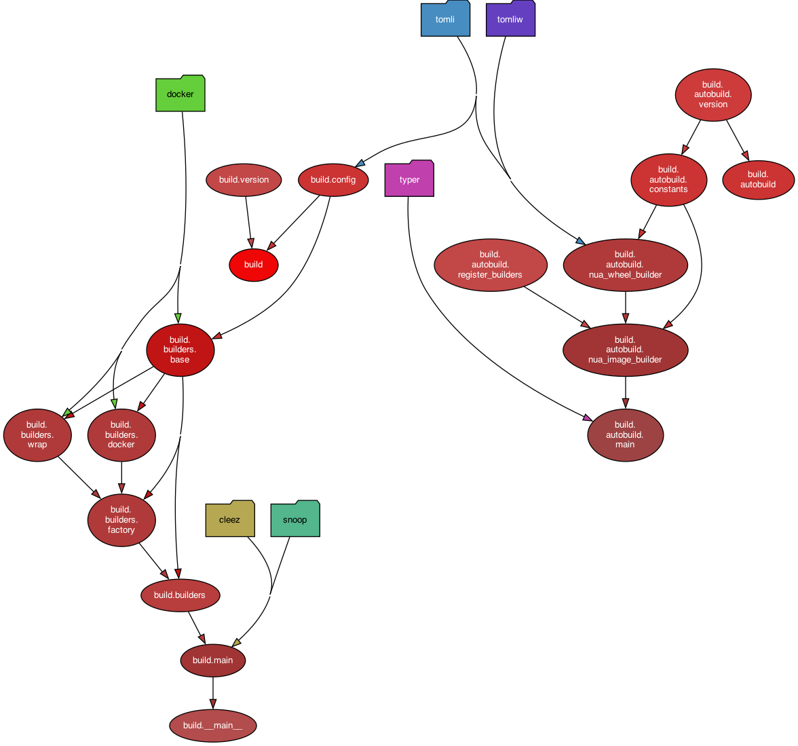

# Nua-build

Build system for Nua packages.

[Nua](https://nua.rocks/) is an open source, self-hosted cloud platform project (a PaaS - platform as a service).

This packaged is mostly used internally. The main entry point is the `nua` command line tool (see: [Nua on PyPI](https://pypi.org/project/nua/) or [nua-cli on GitHub](https://github.com/abilian/nua/tree/main/nua-cli)).


## Purpose

The `nua-build` package is used to build packages deployable by the Nua orchestrator.

The current version of nua-build builds Docker images for an amd64 Linux environment. There are plans to extend the system to other container and isolation architectures in future releases.


`nua-build` relies on a `nua-config` configuration file containing application build directives. This configuration can reference other local or remote providers and is supplemented by default values. The file can be formatted as TOML, JSON or YAML.

## Build sequence:

The main steps to build a Nua image:

- Analysis of the `nua-config` file,
- detection of the required base images,
- build or pull base images if needed,
- collect files (Dockerfile, configuration files),
- build a Docker container using the `nua-agent`,
- store locally the resulting images as a `tar` file.


### About Dockerfile

`nua-build` allows 2 approaches for image generation:

- The package can use a generic Dockerfile provided by `nua-build`, in which case most of the containerization work is done by a python script (*build.py*) executed in the container being built. This permits a build with a single `RUN` command in the docker file, but requires to specify the build through the `nua-config` config file and some python script.

- The package can use a dedicated (potentially pre-existing) Dockerfile. Then this Dockerfile must be modified slightly to add the metadata to the image:

```dockerfile
RUN mkdir -p /nua/metadata
COPY nua-config.toml /nua/metadata/
```

### Containerization layers

Standard Nua images are images build from `nua-build`'s default Dockerfile.

Standard Nua images contain three layers:

- A Linux image (Ubuntu 22.04 LTS Jammy, amd64),
- `nua-python`, addition of python 3.10,
- `nua-builder`, addition of `nua-agent` and `nua-lib`.

All standard Nua packages have a Python environment.

Some other base images are available to facilitate builds in other programming environments: `nua-builder-nodejs16`, `nua-builder-nodejs18`, `nua-builder-nodejs20`.

## Dependencies on other Nua Python packages

`nua-build` uses the following packages:

- `nua-lib`: common code for all Nua packages. It provides:

    - `shell`: shell shortcuts (mostly wrappers above `subprocess` and `shutil`)
    - `exec`: shortcuts to execute sub commands like `exec_as_root()`, `exec_as_root()`
    - `actions`: higher level commands, related to the installation of packages and dependencies (wrappers above `apt`, `pip`, ...)

- `nua-agent`: agent for building Nua apps. It provides:

    - `app_builder`: actual builder of the application inside the Docker image.

## Dependency graph


