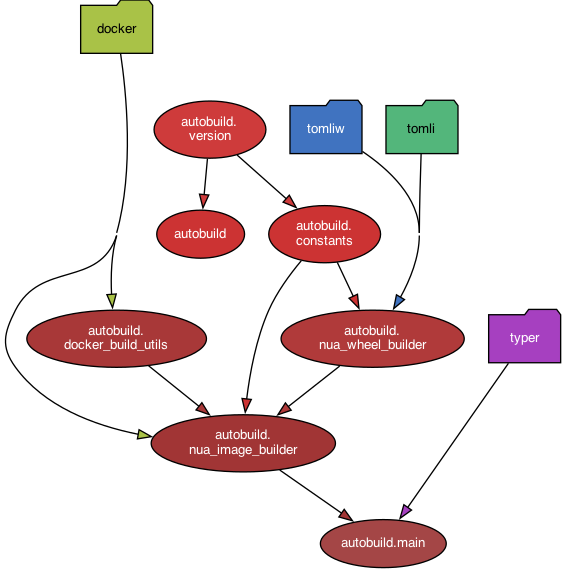

# `nua.build.autobuild` package

This package, created base images used to speed up and standardize the build of Nua packages.

If these images are not available (locally or on a remote repository), `nua-autobuild` builds them locally.

## Content

`nua-autobuild` provides the following modules:

-   `nua_image_builder`: tool to build locally the Nua standard base images
-   `nua_wheel_builder`: tool to build 'wheels' from the Nua packages
-   `docker_build_utils`: utilities to build Docker images

## Dependency graph

