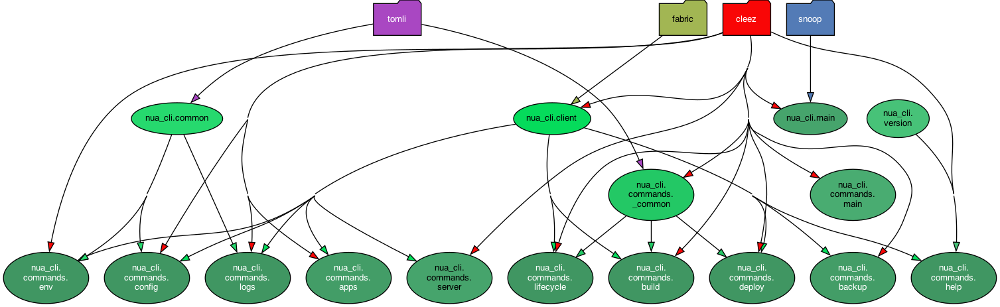

# nua-cli: CLI for NUA (for users)

Command-line interface for Nua.

[Nua](https://nua.rocks/) is an open source, self-hosted cloud platform project (a PaaS - platform as a service).

Used by developers and devops people to deploy and manage applications.

## Installation

### From PyPI

On PyPI the package is called just `nua` (not `nua-cli`) as it is the main interface for Nua users.

```bash
pipx install nua
nua
```

### From source

When developing nua-cli, you can install it from the source repository:
```bash
pipx install --force "git+https://github.com/abilian/nua.git#subdirectory=nua-cli"
```

Or, in editable mode, from your local clone:
```bash
pipx install --force -e path/to/nua/nua-cli
```

## Usage

```bash
nua --help
# or
nua [command] [options]
```

### Main commands and subcommands

Here's the list of commands and subcommands provided by nua-cli (some of them are not yet implemented):

```
nua (0.5.17)

Usage:
  nua <command> [options] [arguments]

Options:
  -V  Show version and exit
  -d  Enable debug mode
  -v  Increase verbosity

Available commands:
  apps     List applications.
  backup   Backup a deployed application.
  build    Build app but don't deploy it.
  deploy   Deploy app.
  destroy  Destroy an application.
  help     Show help.
  logs     Show application logs.
  restart  Restart an application.
  restore  Restore backup data of a deployed application.
  start    Start an application.
  stop     Stop an application.
  update   Update an application.

 config
  config show      Show application config.

 env
  env set          Show application env variables.
  env show         Show application env variables.

 server
  server cleanup   Cleanup server (remove inactive docker images and containers).
  server logs      Show server logs.
  server ps        List all server processes.
  server settings  Show server settings.
  server status    Show Nua status.
  server uptime    Show server uptime.
```


<!-- TODO: add more specific examples -->


## Development

### Dependency graph


