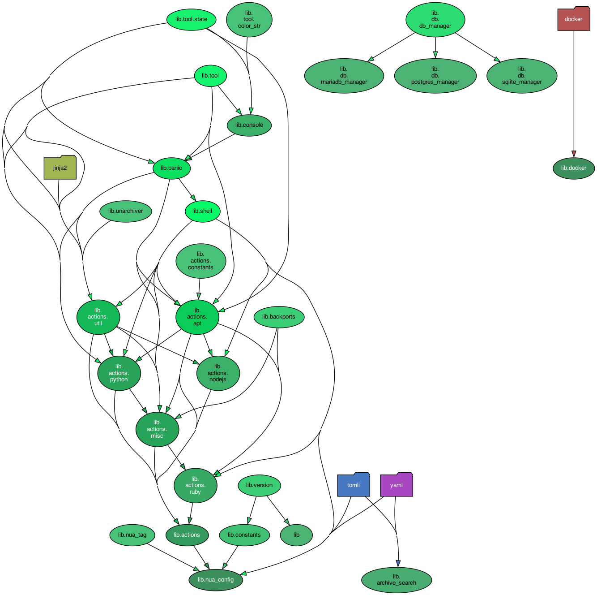

# Nua Lib

[Nua](https://nua.rocks/) is an open source, self-hosted cloud platform project (a PaaS - platform as a service)

This subproject contains code that is shared between the various [Nua](https://nua.rocks/) subprojects.

It is not intended to be useful outside Nua, and is not intended to be used as a standalone library.

Since the `nua-lib` code being used by `nua-agent`, it should have as little dependencies as possible

## Content

`nua-lib` provides:

- `shell`: shell shortcuts (mostly wrappers above subprocess and shutil)
- `exec`: shortcuts to execute sub commands like exec_as_root(), exec_as_root()
- `action`: higher level commands, related to the installation of packages and dependencies (wrappers above apt, pip, ...)
- and a few utilities of minor importance.

## Dependency graph

