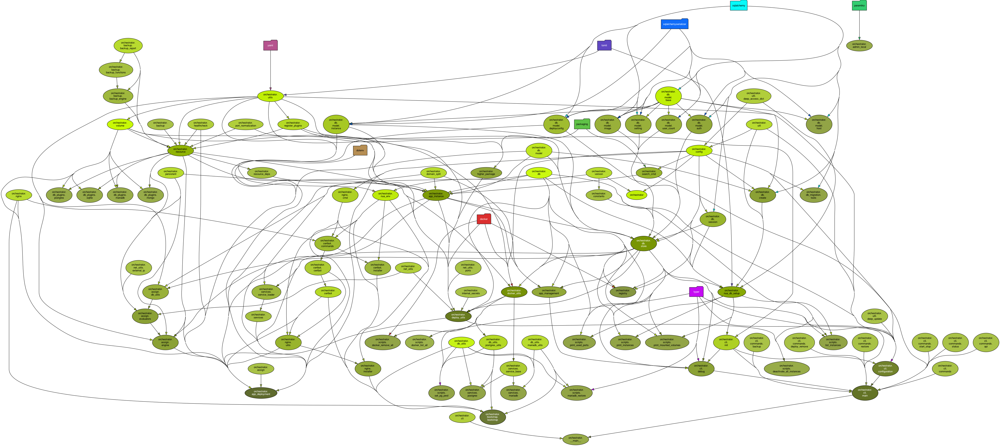

# Nua orchestrator

[Nua](https://nua.rocks/) is an open source, self-hosted cloud platform project (a PaaS - platform as a service).

This packaged is deployed on the Nua server.

For end-users, the main entry point is the `nua` command line tool (see: [Nua on PyPI](https://pypi.org/project/nua/) or [nua-cli on GitHub](https://github.com/abilian/nua/tree/main/nua-cli)).


## Role of the orchestrator

The orchestrator is in charge of configuring application and providers and deploying them on the host.

## Requirements

The host must be a linux server installed with the distribution:

    Ubuntu 22.04.1 LTS (jammy)

Note: this is temporary, the orchestrator will be able to manage other distributions later.

In the current version, the orchestrator manages locally a single host.

Note: this is temporary, the orchestrator will be able to manage multiple hosts later.


The Nua Orchestrator will need a 'nua' administrator account with root privileges (sudoer and docker groups).

The Nua Orchestrator will interfere with local providers such as Docker services and locally installed databases. The recommended configuration is therefore to use a dedicated server.

The following Python packages (provided by Ubuntu) are required:

- `python3.10`
- `python3.10-venv`
- `python3.10-dev`
- `python3-pip`
- `pipx`

i.e. you should run `apt-get install python3.10 python3.10-venv python3.10-dev python3-pip pipx` before installing Nua.

Note: this is temporary, the installation script will take care of this kind of details later.


## Installation

### All-in-one command

Simply run:

```console
curl -L https://nua.rocks/install.py | sudo python3
```

### Using the `nua-bootstrap` command

The `nua-orchestrator` package provides a `nua-bootstrap` command which will install Nua on the host.

#### Installation procedure (from released version)

From the root account:

```console
pipx install nua-orchestrator
nua-bootstrap
```

#### Installation procedure (from git)

At the moment, this implies a first temporary installation of Nua (which can be done in a temporary directory), from a sudo-able account:

```console
git clone https://github.com/abilian/nua src
cd src/nua-orchestrator
./install.py
sudo ./env/bin/nua-bootstrap
```

That command will do many things:

- create the `nua` account
- install the required packages (Docker, postgres, Nginx, ...)
- apply default configuration to the host
- ...

### Remarks

- `nua-bootstrap` can be safely launched on an existing configuration,

### Installation phases

Installation can take several minutes, here an excerpt of main messages displayed during installation:

```console
sudo /home/nua/env/bin/nua-bootstrap
Installing Nua bootstrap on local host.
Warning: Nua was already installed.
Ign:1 http://downloads.mariadb.com/Tools/ubuntu jammy InRelease
Hit:2 http://nova.clouds.archive.ubuntu.com/ubuntu jammy InRelease                                                                        [...]
Installation of base packages:
apt-get install --no-install-recommends -y ca-certificates curl docker.io lsb-release git nginx-light software-properties-common python3-certbot-nginx
[...]
Modifying /etc/sudoers for user 'nua' (full access with no passwd)
-> Prior changes found: do nothing
Creation of Python virtual environment for 'nua'
-> Prior /home/nua/env found: do nothing
Install pip
[...]
Installation of postgres version 14
apt-get install --no-install-recommends -y postgresql-14 libpq-dev
[...]
Setting Postgres password
Installation of Nua nginx configuration
systemctl restart nginx
Installation of local Nua orchestrator (via git)
Cloning into 'nua'...
[...]

Nua installation done for user 'nua' on this host.
Command 'nua --help':
```

At the end of the installation, the available commands are displayed.

## Development

### Dependency graph


